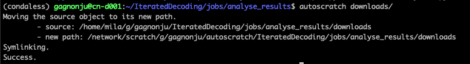

# Autoscratch 🚀  ✏️ 
Moves the target file or directory to the scratch in a subdirectory imitating its current position in $HOME, and then replaces it by a symlink.

## Example
```bash  
autoscratch ~/the_project_name/model_a/checkpoints/
```
1. Creates a folder at `/network/scratch/[u]/[username]/autoscratch/project_name/model_a/`
2. Moves the checkpoints folder into that folder
3. Creates a symbolic link `~/project_name/model_a/checkpoints` to `/network/scratch/[u]/[username]/autoscratch/project_name/model_a/checkpoints`.

Supports having multiple files as arguments, and the use of filename wildcards (implicitely through bash).

Screenshot of the process:


## Setup
```
git clone git@github.com:JulesGM/autoscratch.git
cd autoscratch
pip install .
```


# autoscratch_undo
Just run `autoscratch_undo` on a symlink created by `autoscratch` to do the inverse operation.

Also supports having multiple files as arguments, and the use of filename wildcards (implicitely through bash).